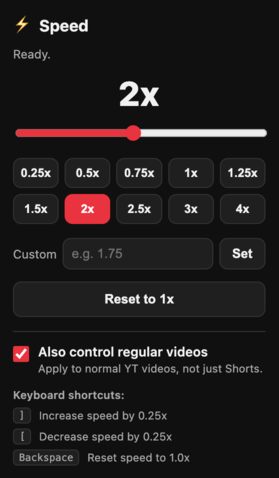
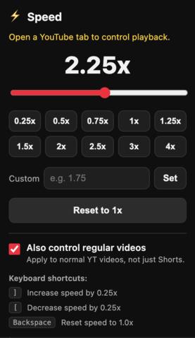

# YT Shorts Speed Control

A Chrome and Firefox extension to control YouTube playback speed with mpv-like
keybindings. Built for Shorts, with optional support for regular videos.

## Features

- **Presets** — one-click speeds: 0.25x, 0.5x, 0.75x, 1x, 1.25x, 1.5x, 2x,
  2.5x, 3x, 4x
- **Slider** — drag for fine control between 0.25x and 4x
- **Custom input** — type any speed from 0.1x up to 16x
- **Keyboard shortcuts** (mpv-style) — see the table below
- **Persists your chosen speed** and re-applies it as YouTube swaps between
  Shorts (which otherwise reset to 1x)
- **On-screen badge** shows the speed when it changes
- **Optional: regular videos** — off by default; enable in the popup to use the
  same speed control and shortcuts on normal videos

### Keyboard shortcuts

| Key         | Action                  |
| ----------- | ----------------------- |
| `]`         | Increase speed by 0.25x |
| `[`         | Decrease speed by 0.25x |
| `Backspace` | Reset speed to 1.0x     |
| `P`         | Pause / play            |

## Local install / testing

### Chrome / Chromium

1. Clone this repo.
2. Open `chrome://extensions`.
3. Enable **Developer mode** (top right).
4. Click **Load unpacked** and select the project folder.
5. Open a YouTube Short and set the speed from the popup or with the keyboard
   shortcuts.

### Firefox desktop 140 or newer

1. Clone this repo and run `deno task package`.
2. Unzip `dist/ytshorts-speed-control-v<version>-firefox.zip`.
3. Open `about:debugging#/runtime/this-firefox`.
4. Click **Load Temporary Add-on**.
5. Select `manifest.json` in the unzipped folder.
6. Open a YouTube Short and set the speed from the popup or with the keyboard
   shortcuts.

Firefox removes temporary add-ons when the browser closes. The Firefox ZIP in
GitHub Releases is unsigned; a permanent install requires Mozilla signing.

## Usage

- On a Short (or a regular video with the setting enabled), use the popup
  controls or the keyboard shortcuts above.
- The keyboard shortcuts are ignored while you're typing in a field (search,
  comments) and don't hijack browser combos like `Cmd`/`Ctrl`+`[`.
- To control normal videos, open the popup and tick **"Also control regular
  videos"**. Turning it back off resets the current video to 1x.

## Examples

The popup on a YouTube page, and on a non-YouTube page (where it prompts you to
open YouTube):




## Development

This project uses [Deno](https://deno.com) for formatting, linting, and tests
(no `node_modules`, no build step).

```bash
deno task test      # run unit tests
deno task check     # fmt --check + lint + test
deno task package   # create Chrome and Firefox ZIPs in dist/
deno fmt            # format
deno lint           # lint
```

`manifest.json` targets Chrome. `manifest.firefox.json` adds Firefox signing,
minimum-version, and no-data metadata. The packaging task uses the `zip`
command and puts the correct manifest at the root of each archive.

The helpers in `lib/speed.js` are covered by unit tests in
`tests/speed_test.js`. Manifest tests keep the shared Chrome and Firefox fields
in sync.

## Privacy and permissions

This extension is privacy-respecting by design: it makes **no network
requests**, collects **no data**, and includes **no tracking or analytics**.
Your chosen speed and settings are stored locally on your device via the
browser's storage API.

- **Storage** — to remember your chosen speed and settings
- **Host access to `youtube.com`** — to read/adjust the video element on
  YouTube pages

No data leaves your browser.

## License

[AGPL-3.0-or-later](LICENSE) © hawkff
