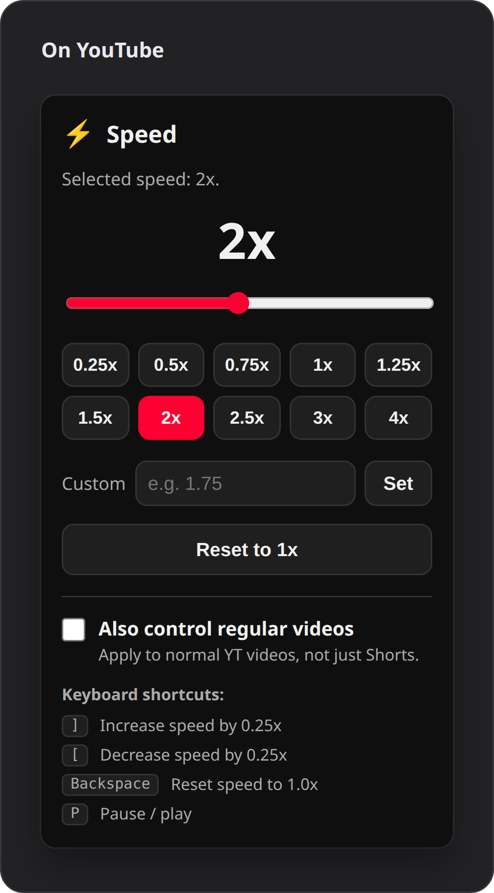
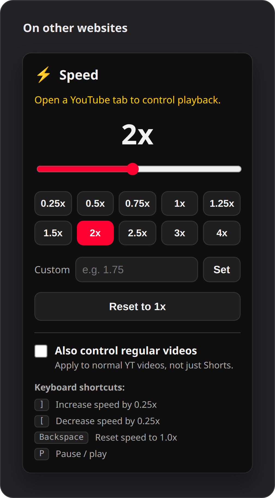

# YT Shorts Speed Control

Control YouTube Shorts playback speed with a popup or mpv-style keyboard
shortcuts. Keep your chosen speed as you move between Shorts, and opt in to use
the same controls on regular videos.

For Chrome, Chromium-based browsers, and Firefox desktop 140 or newer.

<p>
  
  
</p>

## Install

Download the ZIP for your browser from the
[latest release](https://github.com/hawkff/ytshorts-speed-control/releases/latest).
You do not need Deno to install a release.

### Chrome and Chromium-based browsers

1. Download the file ending in `-chrome.zip` and extract it.
2. Open `chrome://extensions` and turn on **Developer mode**.
3. Click **Load unpacked** and select the extracted folder containing
   `manifest.json`.
4. Open a YouTube Short. Reload any YouTube tabs you had open before installing.

You can also load this repository's root folder without a build step.

### Firefox desktop

1. Download the file ending in `-firefox.zip` and extract it.
2. Open `about:debugging#/runtime/this-firefox`.
3. Click **Load Temporary Add-on** and select `manifest.json` in the extracted
   folder.
4. Open a YouTube Short. Reload any YouTube tabs you had open before installing.

Firefox requires version 140 or newer. This is a temporary install that Firefox
removes when you close the browser. The release ZIP is unsigned; a permanent
install requires Mozilla signing.

## Set your speed

Click the extension icon while you have a YouTube tab open.

- Choose a preset: 0.25x, 0.5x, 0.75x, 1x, 1.25x, 1.5x, 2x, 2.5x, 3x, or 4x.
- Drag the slider between 0.25x and 4x in steps of 0.05x.
- Enter a custom speed from 0.1x to 16x and click **Set**.
- Click **Reset to 1x** to return to normal speed.

Your speed carries over to the next Short and stays saved between browser
sessions. A brief on-screen badge shows speed changes. If you change the speed
while a video is paused, it takes effect when playback resumes.

To use these controls on regular YouTube videos, check **Also control regular
videos** in the popup. The setting is off by default. Turning it off returns the
current regular video to 1x.

On other websites, the popup prompts you to open YouTube. You can still save a
speed there for your next visit.

### Keyboard shortcuts

Use these while watching a Short, or a regular video with the setting enabled.

| Key         | Action                  |
| ----------- | ----------------------- |
| `]`         | Increase speed by 0.25x |
| `[`         | Decrease speed by 0.25x |
| `Backspace` | Reset to 1x             |
| `P`         | Pause or play           |

Shortcuts do not run while you type in a search box, comment, or other input.
Browser shortcuts such as `Ctrl`/`Cmd` + `[` and `Ctrl`/`Cmd` + `P` keep their
normal behavior.

## Privacy and permissions

The extension makes no network requests and includes no analytics or tracking.
It stores your speed and settings on your device with `storage.local`, not
browser sync.

It requests two permissions:

- `storage` to remember your speed and settings.
- Access to `https://www.youtube.com/*` and `https://m.youtube.com/*` to control
  video playback and handle shortcuts on YouTube.

## Development

The extension uses plain JavaScript, HTML, and CSS. Load the repository in
Chrome to try changes. Use [Deno 2](https://deno.com/) for the development
tasks.

```sh
deno task test     # Run tests
deno task check    # Check formatting, lint, type-check packaging, and run tests
deno task package  # Create Chrome and Firefox ZIPs in dist/
```

Use `deno fmt` to format the source and `deno lint` to lint it. Packaging also
requires the `zip` command. There is no dependency-install or build step for the
extension itself.

`manifest.json` targets Chrome. `manifest.firefox.json` adds Firefox metadata;
the packaging task puts the matching manifest in each archive. Tests cover speed
calculations, settings, popup interactions, content-script behavior, and
manifest consistency.

## License

[AGPL-3.0-or-later](LICENSE)
